# Chat window UI evidence

Rendered in the synthetic Console integration against this candidate SDK core.
No regional reads, credentials, remote uploads or WhatsApp sends. The media
fixture uses a local file and Blob URL. Chromium captured full-length PNGs at
2x scale. Exact source revisions and viewports are recorded in
[the capture manifest](images/chat-window/manifest.json).

## Desktop

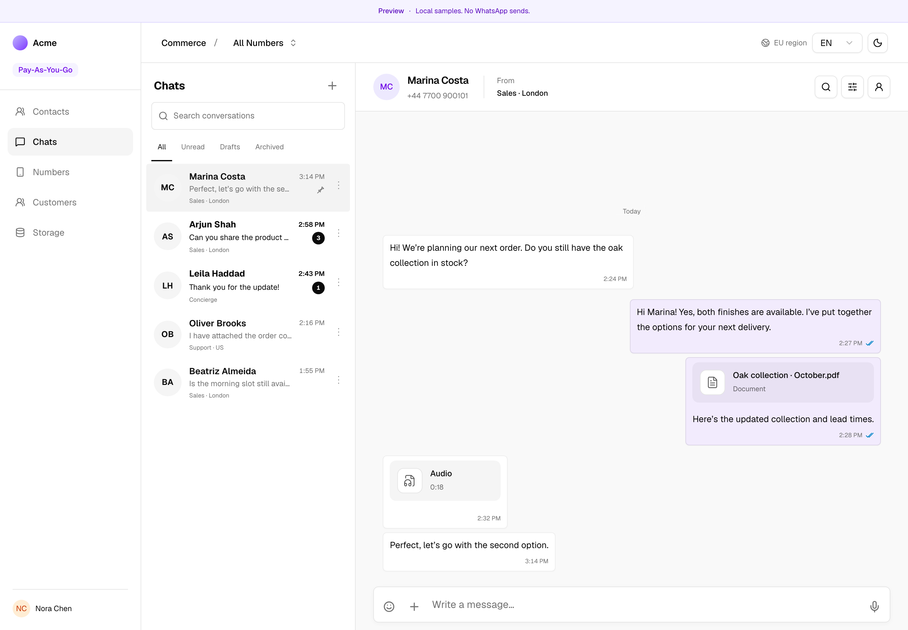

## Mobile

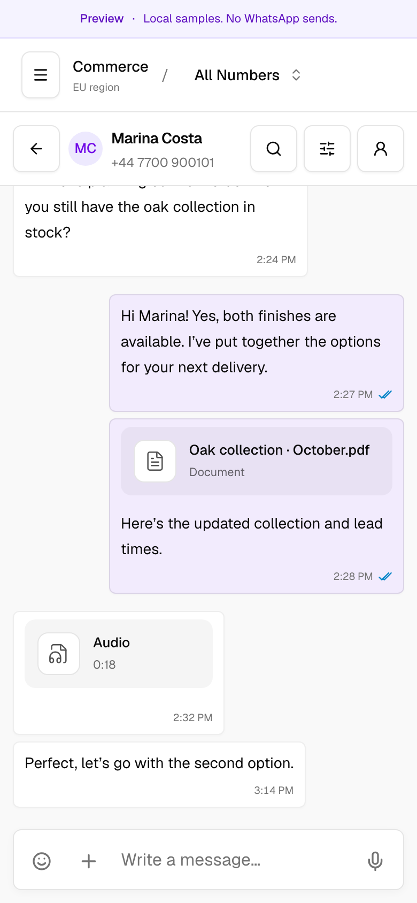

## Media choices

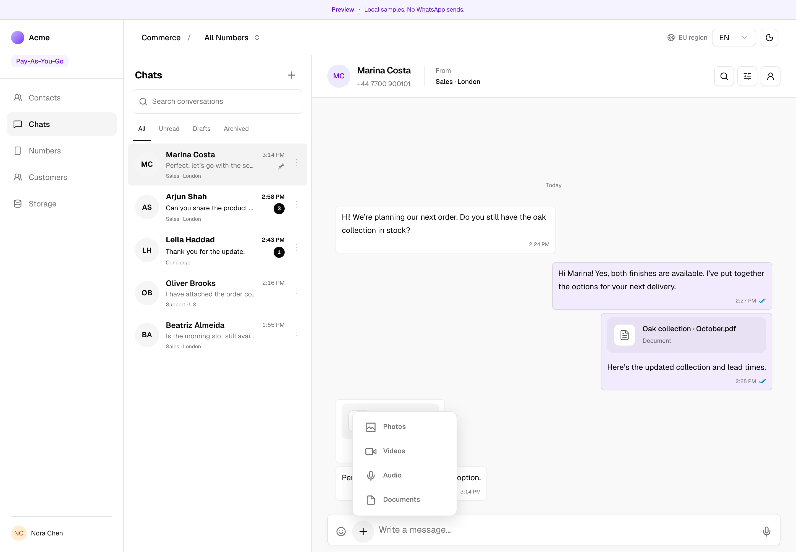

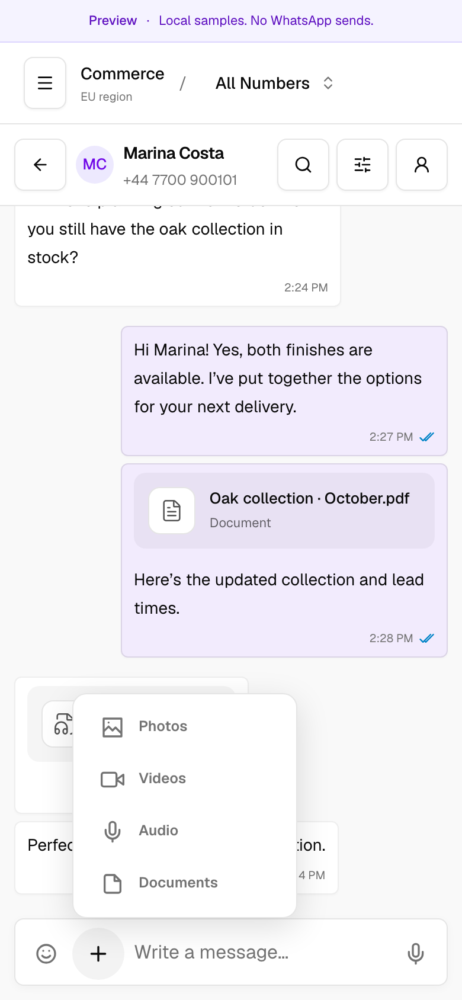

## Media draft

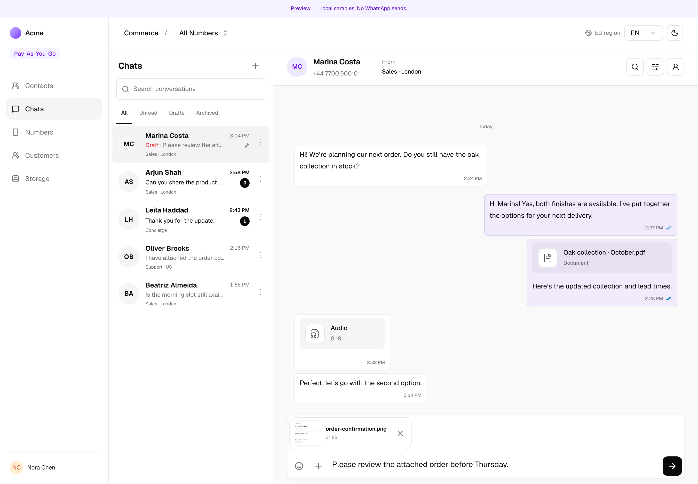

## Failed send

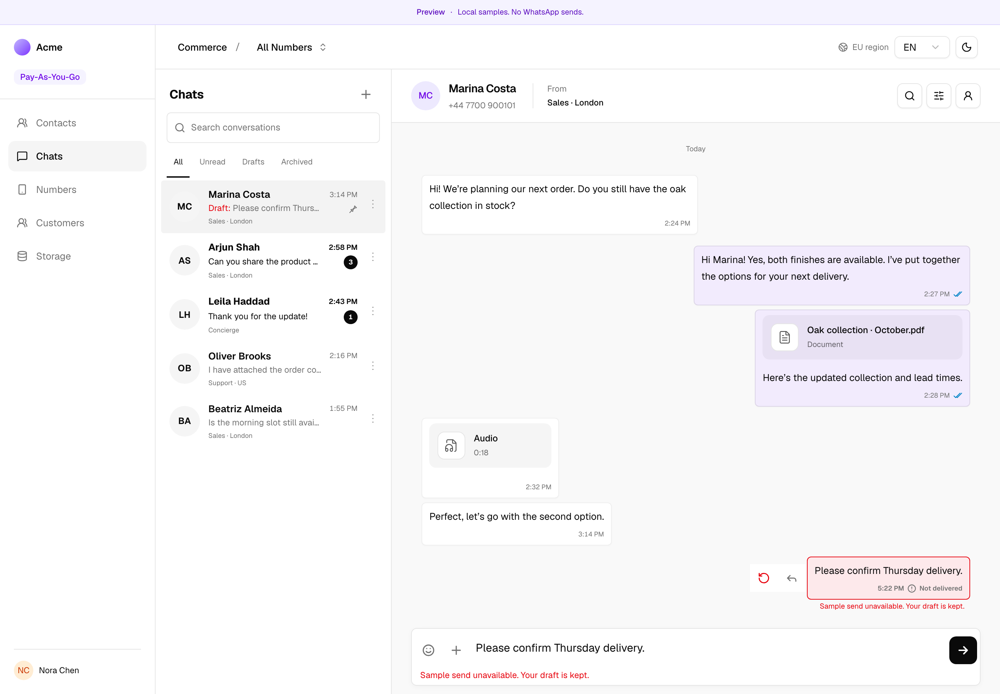

## Native inbox

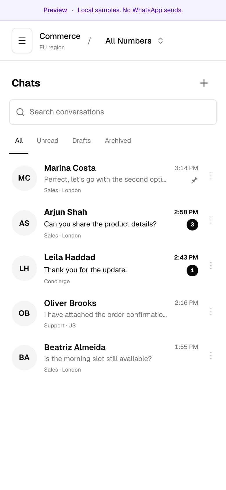

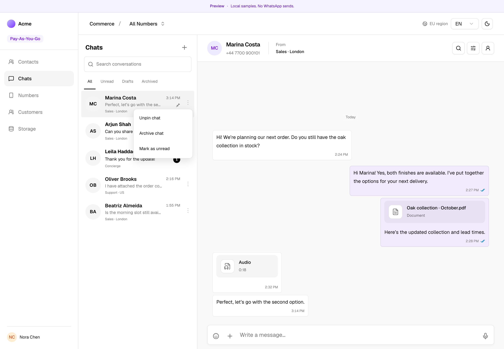

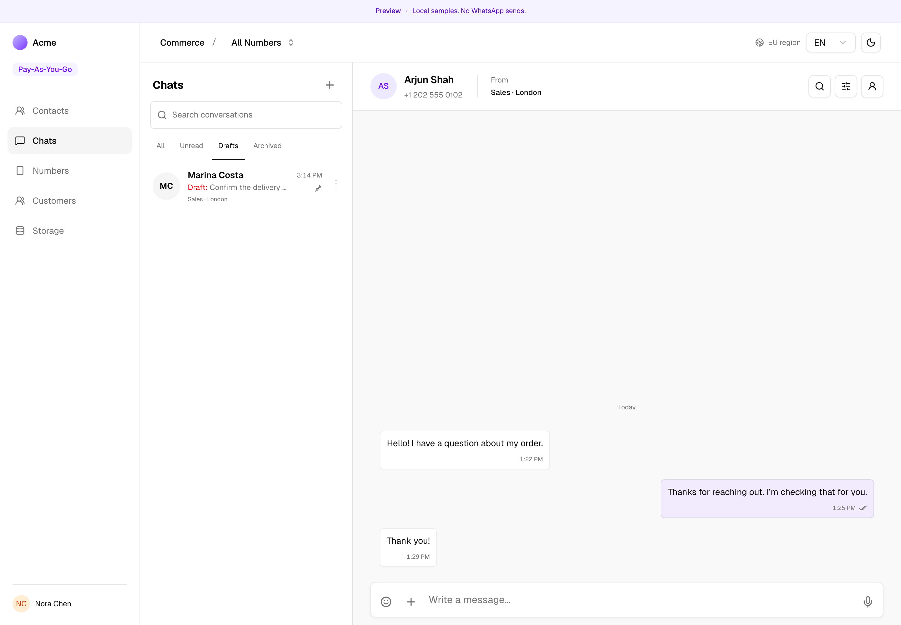

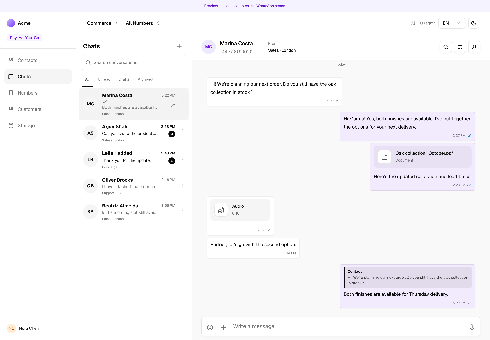

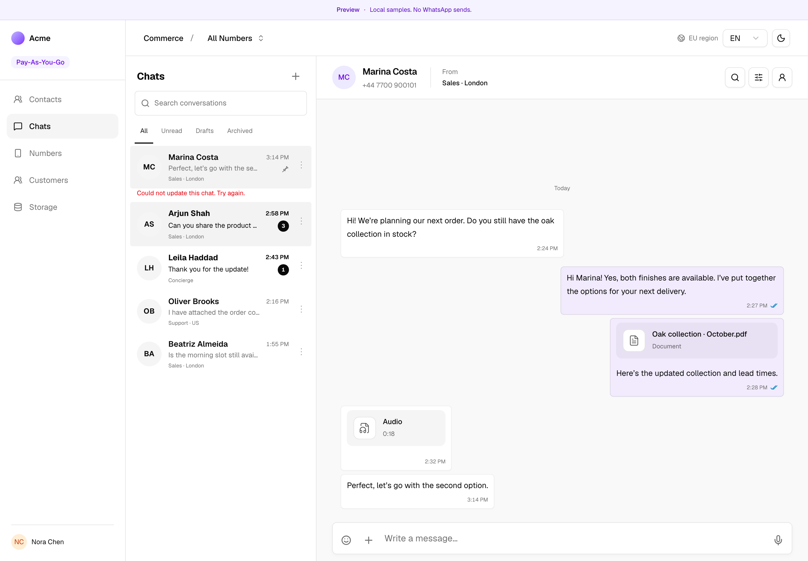

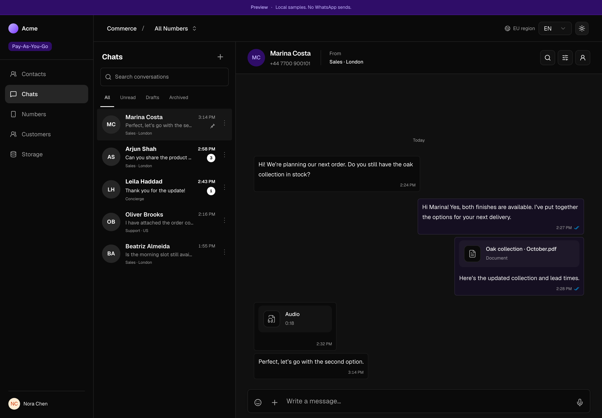

Action menus acknowledge local sample callbacks only. WhatsApp synchronization
requires authorized host adapters and supported producer contracts; it is not
performed by this preview.
