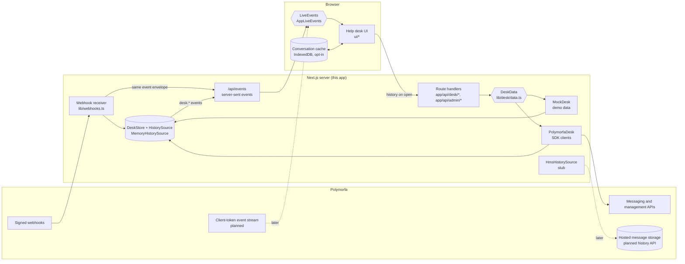

# Acme Support: full-platform example

Acme Support is a multi-agent WhatsApp help desk built with Next.js on every
public Polymorfa SDK surface: the Messaging and management server clients,
signed webhooks, the browser controllers, the React components, the Web
Components, the Next.js route helpers, and the development assistant.

It runs without any keys. When `POLYMORFA_PROJECT_TOKEN` is empty, the server
serves built-in demo data: 25 tickets across three queues, conversations with
photos, video, voice notes, documents, locations, contact cards, stickers,
reactions and a chatbot handoff, plus contacts, templates, campaigns and
connections. Replies get delivery ticks, read receipts and the occasional
customer answer, pushed to the browser as live events.

## What is inside

- **Tickets.** Three panes: a ticket list with Open, Pending and Resolved tabs,
  search and filters by queue, tag, number and assignee; a WhatsApp-style chat;
  and a contact panel with tags, custom fields, notes, ticket history, block
  and mute. Accept, transfer to an agent or queue, resolve and reopen. A
  server-computed countdown shows how long the 24-hour reply window stays
  open; when it closes, the composer turns into a template picker with a
  parameter form and live preview.
- **Composer.** The SDK `ComposeBox` with emoji, voice notes, attachments,
  replies, `/` quick replies, private notes, and an attach menu for documents,
  photos and videos, contact cards, locations, reply buttons (1–3), list
  messages and templates.
- **Every message type.** Text, image, video, audio with a waveform and
  transcript, document, location, contact, sticker, template, interactive
  replies, reactions, automation badges and system events.
- **Keyboard.** `J`/`K` next and previous ticket, `R` reply, `E` resolve, `A`
  accept or assign to me, `/` quick replies, `?` shortcut sheet.
- **Contacts, Dashboard, Campaigns, Templates, Quick replies, Tags,
  Connections, Calls, Admin and Settings** pages, with light and dark themes,
  an accent color, compact density, right-to-left languages, and layouts from
  360px phones to wide desktops.

## Run it

The Polymorfa packages are not on npm yet. Inside this repository, build them
first:

```bash
npm ci
npm run build
npm run build:workspaces
```

Then install the example's dependencies, pointing the `@polymorfa/*`
dependencies at the local builds (for example with `npm link` or packed
tarballs), and start it:

```bash
cd examples/full-platform
npm install
npm run dev
```

Open `http://localhost:3000` and use the demo sign-in. With no `.env.local`,
the app runs on demo data.

The demo sign-in sets unsigned cookies that anyone can forge to claim any user
or the admin role. It works in development, and in production only while the
app runs on demo data. Replace `lib/auth.ts`, `app/api/demo-login` and
`app/api/demo-logout` with your own authentication before you use real
credentials anywhere but your machine. With demo data on, the client token
routes refuse to mint tokens, so forged cookies never reach Polymorfa.

## Deploy

[](https://vercel.com/new/clone?repository-url=https%3A%2F%2Fgithub.com%2Fpolymorfa%2Fsdks&root-directory=examples%2Ffull-platform&project-name=acme-support)

The button is a placeholder until the `@polymorfa/*` packages are published;
set the project's root directory to `examples/full-platform`. Demo mode needs
no environment variables. To use your Polymorfa project, add the variables
below in the Vercel project settings.

The in-memory stores in this example hold one process's state. Serverless
platforms can run several instances, so use a database and a shared pub/sub
for history, tickets and live events before relying on a deployment.

## Connect your Polymorfa project

Copy `.env.example` to `.env.local` and fill it in:

| Variable                             | Used for                                                                            |
| ------------------------------------ | ----------------------------------------------------------------------------------- |
| `ACME_DEMO_DATA`                     | `true` forces demo data even when credentials are set                               |
| `POLYMORFA_PROJECT_TOKEN`            | `MessagingClient`, `BridgeClient`, and the project view of `Client` (`pmfa_pt_...`) |
| `POLYMORFA_ORGANIZATION_API_KEY`     | The organization `Client` in the admin area and BanSafe Health (`pmfa_...`)         |
| `POLYMORFA_PROJECT_ID`               | The project the project token is bound to                                           |
| `POLYMORFA_PROJECT_SLUG`             | Template and Messaging campaign routes                                              |
| `POLYMORFA_SESSION`                  | The session (number) the support team uses                                          |
| `POLYMORFA_TEMPLATE_SESSION`         | The Cloud API session that submits templates to Meta                                |
| `POLYMORFA_AGENT_SESSIONS`           | Optional comma-separated extra sessions agents may use                              |
| `POLYMORFA_WEBHOOK_SECRET`           | Signing secret of the management webhook at `/api/polymorfa/webhooks`               |
| `POLYMORFA_MESSAGING_WEBHOOK_SECRET` | Secret you choose for the Messaging webhook at `/api/polymorfa/messaging-webhooks`  |
| `APP_ORIGIN`                         | Public origin of this app, for webhook URLs, client rules and CSRF checks           |
| `POLYMORFA_API_BASE_URL`             | Optional API origin; defaults to `https://api.polymorfa.com`                        |

These values are server-only. Never prefix them with `NEXT_PUBLIC_`.

Then, in **Admin → Messaging API**, apply the session's client rules, and in
**Admin → Webhooks**, register this app. Registration targets
`/api/polymorfa/webhooks` and subscribes to every event the handler uses
(`WEBHOOK_EVENTS` in `lib/webhooks.ts`). The signing secret is shown once,
with `Cache-Control: no-store`; store it as `POLYMORFA_WEBHOOK_SECRET`.
Rotating returns a new secret once, and the previous secret stays valid for
one hour (`overlapSeconds: 3600`).

Alternatively, **Register** under Messaging webhook creates a Messaging
webhook at `/api/polymorfa/messaging-webhooks`, signed with
`POLYMORFA_MESSAGING_WEBHOOK_SECRET`. Register only one of the two so each
event arrives once.

The webhook handler rejects events whose `timestamp` is more than five minutes
from the server clock and ignores repeated event `id`s. The seen-id set is in
memory and bounded; use a durable store in production.

## Architecture



- **History.** The server records every message it receives by webhook or
  sends itself, behind the `HistorySource` interface in
  `lib/desk/history.ts`, and serves history from its own routes when a chat
  opens. `MemoryHistorySource` keeps it in process memory.
  `HmsHistorySource` is a stub for Polymorfa's planned hosted-storage history
  API; it is not wired in and calls no SDK method yet.
- **Live updates.** After the first load, the browser follows changes through
  the `LiveEvents` interface in `lib/browser/live-events.ts`. `AppLiveEvents`
  reads this app's `/api/events` stream. Every event uses the SDK's webhook
  envelope (`WebhookEventOf`): verified webhooks are relayed unchanged, and the
  app's own `desk.*` events use the same shape. A later implementation can read
  Polymorfa's planned client-token event stream instead, so the browser needs
  no connection to this backend. Nothing in the app polls.
- **Data access.** Route handlers only see `DeskData`. `MockDesk` serves demo
  data; `PolymorfaDesk` calls the SDK. Tickets, queues and agents are this
  app's own records: they live in `DeskStore`, standing in for your database.
- **Device cache.** **Settings → Privacy → Cache conversations on this
  device** (off by default) stores recent conversations in IndexedDB
  (`lib/browser/conversation-cache.ts`). A chat renders from the cache first,
  then the backend reconciles it. Turning the setting off or signing out
  clears the cache.

## Features and SDK surfaces

| Feature                                                                | SDK surface                                                                                                         | Files                                                              |
| ---------------------------------------------------------------------- | ------------------------------------------------------------------------------------------------------------------- | ------------------------------------------------------------------ |
| Chat, reply, retry, attachments, date separators                       | `ConversationController`, `MessageComposerController`, `MessageList`, `ComposeBox` (`renderMessage`, `onReply`)     | `ui/tickets/chat.tsx`, `ui/tickets/message-view.tsx`               |
| Emoji, voice notes, `/` quick replies, attach and note actions         | `ComposeBox` `emoji`, `voiceNotes`, `quickReplies`, `startActions`, `endActions`                                    | `ui/tickets/chat.tsx`                                              |
| Sending text, media, voice, location, contact, template, buttons, list | `MessagingClient.messages.send`                                                                                     | `lib/desk/live.ts`, `app/api/messaging/messages/route.ts`          |
| Reactions, read receipts, typing                                       | `messages.react`, `messages.markSeen`, `messages.setTyping`                                                         | `lib/desk/live.ts`                                                 |
| Presence in the chat header                                            | `presence.getForChat`                                                                                               | `lib/desk/live.ts`, `app/api/messaging/presence/route.ts`          |
| New ticket number check, contact import, block and unblock             | `contacts.check`, `contacts.list`, `contacts.block`, `contacts.unblock`                                             | `lib/desk/live.ts`, `app/api/messaging/contacts/route.ts`          |
| Tags on contacts and the Tags page                                     | `labels.list`, `create`, `update`, `delete`, `replaceForChat`                                                       | `lib/desk/live.ts`, `app/api/messaging/labels/route.ts`            |
| Quick replies page and composer menu                                   | `quickReplies.list`, `create`, `replace`, `delete`                                                                  | `lib/desk/live.ts`, `app/api/messaging/quick-replies/route.ts`     |
| Templates library, picker and builder                                  | `templates.list`, `TemplateBuilder`, `TemplateBuilderController`, `createTemplateBuilderRoute`                      | `ui/pages/templates.tsx`, `app/api/polymorfa/templates/route.ts`   |
| Campaigns and the create wizard                                        | `MessagingClient.campaigns` (`list`, `create`, `launch`, `pause`, `resume`, `stop`)                                 | `lib/desk/live.ts`, `app/api/messaging/campaigns/route.ts`         |
| Connections, QR and pairing code, restart, logout, delete              | `sessions.list`, `qr`, `requestPairingCode`, `restart`, `logout`, `delete`, `start`, `stop`                         | `lib/desk/live.ts`, `app/api/messaging/sessions/route.ts`          |
| Connect a number (hosted QuickLink URL only)                           | `quickLinks.create`                                                                                                 | `lib/desk/live.ts`, `app/api/messaging/quicklinks/route.ts`        |
| BanSafe health on connection cards and in Admin                        | `Client.banSafe`                                                                                                    | `lib/desk/live.ts`, `app/api/admin/bansafe/route.ts`               |
| Calls, dial pad, incoming calls                                        | `createBrowserCalls`, `CallSurface`, `DialPad`, `clientTokens.mint`, `voip.reject`, `voip.end`                      | `ui/calls.ts`, `ui/pages/calls.tsx`, `app/api/messaging/calls/*`   |
| Webhooks and live events                                               | `readVerifiedWebhook`, `constructWebhookEvent`, `isEvent`, `WebhookEventOf`                                         | `lib/webhooks.ts`, `lib/realtime.ts`, `lib/browser/live-events.ts` |
| Browser client tokens                                                  | `createClientTokenRoute`, `createMessagingClientTokenMint`                                                          | `app/api/polymorfa/token/route.ts`                                 |
| Theme, accent, density, locale and direction                           | `PolymorfaProvider`, `appearance.darkVariables`, `createLocale`                                                     | `app/providers.tsx`, `ui/pages/settings.tsx`                       |
| Development assistant                                                  | `DevAssistant`, `mountDevAssistant` (`position`, `defaultOpen`, `offset`)                                           | `app/providers.tsx`                                                |
| Web Components                                                         | `definePolymorfaElements`, `pmfa-message-list`, `pmfa-template-builder`                                             | `app/elements/elements.tsx`                                        |
| Admin: organization, members, API keys, project tokens                 | `Client.organizations`, `members`, `apiKeys`, `projectTokens`                                                       | `app/api/admin/organization/route.ts`                              |
| Admin: projects, billing, security, customers, audiences, opt-outs     | `Client.projects`, `billing`, `auditLogs`, `securityIncidents`, `sessionBans`, `customers`, `audiences`, `optOuts`  | `app/api/admin/*`                                                  |
| Admin: call policy and do-not-call list                                | `Client.callPolicy`, `callOptOuts`                                                                                  | `app/api/admin/call-consent/route.ts`                              |
| Admin: webhooks, deliveries, events, session settings, platform        | `Client<"project">.webhooks`, `webhookDeliveries`, `events`, `sessionConfiguration`, `SystemClient`, `BridgeClient` | `app/api/admin/*`                                                  |

The routes under `app/api/messaging` and `app/api/admin` cover the rest of the
SDK as JSON actions (groups, channels, privacy, profile, business profile and
commerce, identities, onboarding, observation policies and more). Each takes a
body with an `action` field:

```bash
curl -X POST http://localhost:3000/api/messaging/messages \
  -H 'content-type: application/json' \
  -H 'origin: http://localhost:3000' \
  -H 'idempotency-key: 8a4f1c52-0d7e-4f4e-9d0c-2b8c3c4f0e11' \
  --cookie 'acme_demo_user=casey' \
  -d '{"action":"send","kind":"text","chat":{"phoneNumber":"+15550100"},"text":"Hello"}'
```

In demo mode these routes answer with sample data instead of calling
Polymorfa.

## Credentials by area

| Area                                               | Credential                                                |
| -------------------------------------------------- | --------------------------------------------------------- |
| `app/api/desk/*`                                   | Project token through `MessagingClient` (or demo data)    |
| `app/api/messaging/*`                              | Project token through `MessagingClient`                   |
| `app/api/messaging/media` upload action            | Organization API key (`Client.media`), admin role only    |
| `app/api/admin/*` except the rows below            | Organization API key through `Client`                     |
| `app/api/admin/events`, `webhooks`                 | Project token through `Client<"project">`                 |
| `app/api/admin/webhooks` `GET ?owner=organization` | Organization API key through `Client`                     |
| `app/api/admin/settings`                           | Organization API key and project token views              |
| `app/api/admin/bridge`                             | Project token (`BridgeClient`), no key for `SystemClient` |
| Browser pages                                      | Short-lived `pmfa_ct_` client tokens minted by the server |

Browsers never receive a server credential. `lib/polymorfa.ts` calls
`assertServerRuntime()` before constructing a credentialed client, and
`lib/route.ts` maps each SDK error class to an HTTP status.

## Security notes

- Route handlers that change state accept only JSON requests
  (`content-type: application/json`) whose `Origin` equals `APP_ORIGIN`, and
  answer 415 or 403 otherwise. Uploads are JSON too.
- Uploaded and received media is served inline only for common image, audio
  and video types, always with `X-Content-Type-Options: nosniff` and
  `Content-Security-Policy: sandbox`; everything else downloads as
  `application/octet-stream`. Polymorfa fetches uploads through short-lived,
  HMAC-signed URLs.
- Session controls, campaigns, QuickLink creation and admin pages require the
  admin role on the server, not only in the UI.
- QuickLink is a page hosted by Polymorfa. The app creates a link and sends
  the person to its `url`; it renders no QuickLink UI. New sessions are
  created through QuickLink, so there is no session "create" call.

## Limits of this example

- Sources import each other with `.js` specifiers so the root NodeNext
  typecheck accepts them. `next.config.mjs` maps those specifiers to the
  `.ts` and `.tsx` files.
- Tickets, history, uploads and live events live in one server process. Use a
  database, object storage and a shared pub/sub in production.
- The Messaging API does not serve chat history yet, so a chat shows messages
  this app received through webhooks or sent itself.
- Agents, queues and assignment are app-side concepts; this example seeds
  them and does not persist changes.
- Voice note transcripts are a placeholder; connect a speech-to-text service
  to fill them in.
- The server SDK has no call placement method. Calls are placed with the
  browser client token through `BrowserCallsApi`.
- Management campaign, audience, opt-out, and media payloads are open objects
  in the API contract. Those admin-only routes forward the caller's `payload`
  unchanged.
