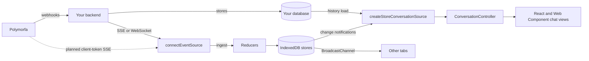

# `@polymorfa/store`

An opt-in IndexedDB store for Polymorfa events in the browser.

When hosted message storage is off, Polymorfa does not keep your messages.
Your backend receives webhooks and stores what it needs. This package keeps a
local, queryable copy of those events in the browser so chat views open
instantly and stay current. It accepts the same event envelope as webhooks,
files each kind of data into its own store, and feeds the
`@polymorfa/browser` conversation controller.

> Polymorfa plans a client-token event stream that carries the webhook event
> shapes, limited to what the client token allows. It is not available yet.
> Until it is, stream events from your own backend with
> `fromEventSource()` or `fromEventStream()`, or replay a backfill with
> `fromIterable()`.

## Architecture



Each `ingest()` call:

1. Drops envelopes for other sessions (when `session` is set) and malformed
   envelopes.
2. Removes token-like fields and your `redact` paths from the payload.
3. Skips event IDs already in the `events` log.
4. Runs the reducer for the event type. Types without a reducer, or whose
   reducer does not file them, go to `custom`.
5. Writes the whole batch in one transaction, then notifies subscribers in
   this tab and, through `BroadcastChannel`, in other tabs.

Reducers never replace newer state with older state. Message status only
moves forward (`pending`, `sent`, `delivered`, `read`, `played`); other fields
keep the time of the event that set them and ignore older updates. A deleted
or revoked message stays a tombstone, so a replayed event cannot restore it.
Messages at or before a `chat.clear` are not restored.

## Usage

```ts
import {
  connectEventSource,
  createPolymorfaStore,
  fromEventSource,
} from "@polymorfa/store";

const store = await createPolymorfaStore({
  name: `support:${user.id}`,
  session: "support",
});

const connection = connectEventSource(
  store,
  fromEventSource("/api/polymorfa/events", { withCredentials: true }),
);

const conversations = await store.conversations.list({
  limit: 20,
  unreadOnly: true,
});
const messages = await store.messages.list({
  conversationId: conversations[0].id,
  limit: 50,
});

// On sign-out
connection.close();
await store.clear();
store.close();
```

Your endpoint sends each webhook event as an SSE frame. Put the event ID in
`id:` so the stream can resume. The `data:` line holds one event envelope or
an array of envelopes. A frame without an `event` field takes the SSE event
name.

```text
id: evt_123
event: message.received
data: {"id":"evt_123","session":"support","timestamp":"2026-09-01T10:00:00Z","event":"message.received","payload":{...}}
```

`fromEventSource()` passes the saved cursor as the `lastEventId` query
parameter on a new page load. `EventSource` cannot send headers; use
`fromEventStream()` when your endpoint needs an `Authorization` header.
`headers` runs before every connection, and the store never saves what it
returns. Reconnects wait at least 250 ms, even when the server sends a
shorter `retry`. A line longer than 1 MiB drops the connection.

If a write fails, `connectEventSource()` reports the error through
`onError`, keeps the checkpoint before the failed batch, and stores nothing
more. Close the connection and connect again to resume from the checkpoint.

Pass `format: "project"` to read frames in the Polymorfa project event stream
format. The adapter decodes the base64 webhook body in each `event` frame and
saves the frame's `cursor` as the checkpoint. It skips events without a
retained body, but still resumes after them. It ignores `ready` and
`heartbeat` frames. It reconnects after `expiry`, `dropped`, or a `gap` that
is not `retention_exceeded`. After `revoked`, it stops and reports an error.
The project stream requires a server credential, so relay it through your
backend. Never send a server credential to a browser.

### Chat components

`createStoreConversationSource()` implements `ConversationDataSource`, so
`ConversationController` and the React and Web Component chat views work
without changes.

```ts
import { ConversationController } from "@polymorfa/browser";
import { createStoreConversationSource } from "@polymorfa/store";

const controller = new ConversationController(
  createStoreConversationSource(store, {
    conversationId: "chat_1",
    load: (cursor, signal) => fetchHistory("chat_1", cursor, signal),
    send: (message, signal) => sendThroughBackend("chat_1", message, signal),
  }),
);
await controller.load();
```

The first `load()` returns the local messages at once and reconciles with
your backend in the background. If the store has no messages for the
conversation, it waits for the backend. After the local pages run out, the
controller pages through your backend and the results are stored.
Store changes from live events reach the controller as upserts and deletes.

### React

```tsx
import { usePolymorfaStoreQuery } from "@polymorfa/store/react";

const { data, loading } = usePolymorfaStoreQuery(
  store,
  "conversations",
  (current) => current.conversations.list({ limit: 20 }),
);
```

The hook runs the query again when a listed store changes in any tab. Pass a
fourth `key` argument that changes when the query inputs change.

## Privacy

- Nothing is stored until your application calls `createPolymorfaStore()`.
- Message text, captions, media URLs, contact names, and raw event payloads
  are written to the device. Anyone with access to the browser profile can
  read them unless you pass `encrypt` and `decrypt`.
- `encrypt` receives the fields in `SENSITIVE_FIELDS` for each row and
  returns a structured-cloneable value. Indexed fields (IDs, times, unread
  counts, status) stay readable so queries work. Keep the key out of
  persistent storage, for example a non-extractable `CryptoKey` derived per
  sign-in.
- `redact` removes payload paths before an event is reduced or logged:
  `{ events: "message.*", paths: ["pushName"] }`.
- The store never keeps credentials. It removes fields named like tokens,
  secrets, passwords, authorization, or API keys, and replaces any value
  starting with `pmfa_` with `[redacted]`.
- Name each store for one signed-in user and session, and call `clear()` on
  sign-out.
- Retention limits how long data stays. See [Retention](#retention).

## Storage modes

`store.mode` is `indexeddb` or `memory`. The store uses memory when IndexedDB
is missing (server rendering, some private browsing modes) or fails to open,
and `store.fallbackReason` says why. Memory data lasts for the page and is
not shared between tabs.

`estimateUsage()` returns `navigator.storage.estimate()` results, or
`undefined` when the browser does not support it. `persist()` asks the
browser not to evict the origin's storage and returns `false` when that is
not supported.

## Retention

Retention runs on open, every `sweepIntervalMs` (one hour by default; `0`
disables the timer), and on `sweep()`. Rows are ordered by the time of the
newest event applied to them.

| Store           | Default             |
| --------------- | ------------------- |
| `conversations` | 10,000 rows         |
| `messages`      | 100,000 rows        |
| `contacts`      | 20,000 rows         |
| `presence`      | 1 day, 5,000 rows   |
| `calls`         | 90 days, 5,000 rows |
| `labels`        | 1,000 rows          |
| `sessions`      | 100 rows            |
| `templates`     | 2,000 rows          |
| `events`        | 7 days, 10,000 rows |
| `custom`        | 30 days, 5,000 rows |

Override a store with `{ maxAgeMs, maxRows }`, or pass `false` to keep its
rows.

```ts
await createPolymorfaStore({
  name: "support:user_1",
  retention: { messages: { maxAgeMs: 30 * 24 * 60 * 60 * 1000 } },
});
```

## Event routing

| Event types                                                                          | Store                                           |
| ------------------------------------------------------------------------------------ | ----------------------------------------------- |
| `message.received`, `message.update`, `message.edited`                               | `messages`, conversation summary                |
| `message.sent`                                                                       | `messages` (outbound, `sent`)                   |
| `message.ack`                                                                        | message status                                  |
| `message.reaction`, `message.vote`                                                   | message reactions and votes                     |
| `message.delete`, `message.revoked`                                                  | message tombstone                               |
| `chat.read`, `chat.archive`, `chat.mute`, `chat.clear`, `chat.delete`                | `conversations`                                 |
| `group.update`                                                                       | `conversations` (name, description)             |
| `contact.update`, `blocklist.update`                                                 | `contacts`                                      |
| `presence.update`                                                                    | `presence`                                      |
| `call.*`                                                                             | `calls`                                         |
| `labels.update`                                                                      | `labels`, conversation or message labels, stars |
| `session.status`, `session.connected`, `session.logged_out`, `session.phone_offline` | `sessions`                                      |
| `template.status`                                                                    | `templates`                                     |
| Every other type, including unknown ones                                             | `custom`                                        |

Every accepted event is also appended to `events`. Payload timestamps in
seconds or milliseconds are stored as epoch milliseconds. `message.failed`
has no message ID, so it is kept in `custom`.

Add your own handling with `registerReducer()`:

```ts
store.registerReducer("campaign.completed", async (event, context) => {
  const payload = event.payload as { campaignId: string };
  context.put("custom", {
    id: `campaign:${payload.campaignId}`,
    _t: context.time,
    type: "campaign.summary",
    session: event.session,
    timestamp: event.timestamp,
    payload,
  });
});
```

## API reference

### `createPolymorfaStore(options): Promise<PolymorfaStore>`

| Option             | Description                                                        |
| ------------------ | ------------------------------------------------------------------ |
| `name`             | Required. Database name; include the user and session.             |
| `version`          | Application data version. A change wipes stored data on open.      |
| `session`          | Store only events for this session.                                |
| `retention`        | Per-store `{ maxAgeMs, maxRows }` or `false`.                      |
| `sweepIntervalMs`  | Retention interval. Defaults to one hour; `0` sweeps only on open. |
| `indexedDB`        | `IDBFactory` to use. `null` forces memory mode.                    |
| `broadcastChannel` | Factory for tab sync. `null` disables it.                          |
| `encrypt`          | `(fields, { store, id }) => sealed`. Requires `decrypt`.           |
| `decrypt`          | `(sealed, { store, id }) => fields`.                               |
| `redact`           | `{ events, paths }[]` removed before reducing and logging.         |
| `batchSize`        | Events per write transaction. Defaults to 250.                     |
| `now`              | Clock used for retention.                                          |
| `onError`          | Receives background sweep and listener errors.                     |

### `PolymorfaStore`

| Member                                                                           | Description                                                                                                                                                                                                                         |
| -------------------------------------------------------------------------------- | ----------------------------------------------------------------------------------------------------------------------------------------------------------------------------------------------------------------------------------- |
| `mode`, `fallbackReason`                                                         | Storage mode and the reason for a memory fallback.                                                                                                                                                                                  |
| `ingest(event \| events)`                                                        | Returns `{ accepted, duplicates, ignored }`.                                                                                                                                                                                        |
| `registerReducer(type, reducer)`                                                 | Returns a function that removes the reducer.                                                                                                                                                                                        |
| `conversations.list({ limit?, unreadOnly? })`                                    | Most recent activity first; deleted conversations are omitted.                                                                                                                                                                      |
| `conversations.get(id)`                                                          | One conversation.                                                                                                                                                                                                                   |
| `messages.list({ conversationId, before?, beforeId?, limit?, includeDeleted? })` | Newest first. `before` is epoch milliseconds, exclusive. With `beforeId`, messages created exactly at `before` whose ID sorts before `beforeId` are included too, so pages with shared timestamps continue. `limit` defaults to 50. |
| `messages.get(id)`                                                               | One message, including tombstones.                                                                                                                                                                                                  |
| `messages.upsert(messages, { session? })`                                        | Writes backend history. Live events for the same message win.                                                                                                                                                                       |
| `contacts`, `presence`, `calls`, `labels`, `sessions`, `templates`               | `get(id)` and `list({ limit? })`, most recently updated first.                                                                                                                                                                      |
| `events.list({ types?, since?, limit? })`                                        | The event log, oldest first. `since` is epoch milliseconds, inclusive.                                                                                                                                                              |
| `custom.list({ types?, since?, limit? })`                                        | Events without a reducer.                                                                                                                                                                                                           |
| `checkpoints.get(id)`, `checkpoints.set(id, cursor)`                             | Resume positions.                                                                                                                                                                                                                   |
| `subscribe(store \| "*", listener)`                                              | Receives `{ store, keys, deleted, cleared?, origin }`.                                                                                                                                                                              |
| `sweep()`                                                                        | Applies retention now.                                                                                                                                                                                                              |
| `clear()`                                                                        | Removes every row, including checkpoints.                                                                                                                                                                                           |
| `close()`                                                                        | Stops the sweep timer and tab sync, then closes the database.                                                                                                                                                                       |
| `estimateUsage()`, `persist()`                                                   | Storage quota helpers.                                                                                                                                                                                                              |

### Sources

| Export                                                                                        | Description                                                                                                                                                                               |
| --------------------------------------------------------------------------------------------- | ----------------------------------------------------------------------------------------------------------------------------------------------------------------------------------------- |
| `LiveEventSource`                                                                             | `{ subscribe(listener, { cursor?, onError? }) => unsubscribe }`.                                                                                                                          |
| `connectEventSource(store, source, options?)`                                                 | Resumes from checkpoint `options.checkpoint` (default `default`), batches writes (`maxBatch`, default 500), and saves the cursor after each batch. Returns `{ idle(), cursor, close() }`. |
| `fromEventSource(url \| eventSource, options?)`                                               | Uses `EventSource`. `eventTypes` lists named events to follow (default `DEFAULT_SSE_EVENT_TYPES`, every type a built-in reducer handles); `resumeParam` names the cursor query parameter. |
| `fromEventStream({ url, headers?, fetch?, credentials?, retryMs?, format?, maxLineLength? })` | Uses `fetch`, sends `Last-Event-ID`, and reconnects. `format: "project"` reads the project event stream frames.                                                                           |
| `fromWebSocket(url \| socket, options?)`                                                      | JSON text frames; the last event ID is the cursor.                                                                                                                                        |
| `fromIterable(events, { batchSize? })`                                                        | Replays an array or async iterable. `completed` resolves after delivery.                                                                                                                  |
| `SseParser`, `eventsFromFrame(frame)`, `readProjectStreamFrame(data)`                         | The `text/event-stream` parser, the envelope frame decoder, and the project stream frame decoder.                                                                                         |

### Chat integration

| Export                                               | Description                                                                      |
| ---------------------------------------------------- | -------------------------------------------------------------------------------- |
| `createStoreConversationSource(store, options)`      | `conversationId`, `send`, and optional `load`, `pageSize`, `session`, `onError`. |
| `toConversationMessage(row)`                         | Maps a stored message to `ConversationMessage`.                                  |
| `usePolymorfaStoreQuery(store, stores, query, key?)` | From `@polymorfa/store/react`. Returns `{ data, error, loading }`.               |

`PolymorfaEvent` is the webhook envelope: `id`, `session`, `timestamp`,
`event`, `payload`, and optional `externalId`. The server SDK's
`WebhookEvent` union is assignable to it.
